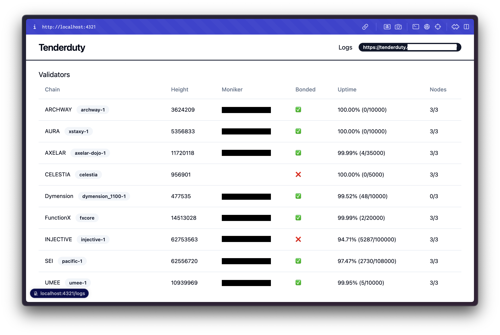

# 📊🌐⛓️ tenderduty-web

Headless Tendermint/Cosmos monitoring web application based on [tenderduty](https://github.com/blockpane/tenderduty) built with Astro.

## Setup

- Setup environment variable as `.env.example`
- Install dependencies `pnpm install`

## Commands

All commands are run from the root of the project, from a terminal:

| Command                   | Action                                           |
| :------------------------ | :----------------------------------------------- |
| `pnpm install`             | Installs dependencies                            |
| `pnpm run dev`             | Starts local dev server at `localhost:4321`      |
| `pnpm run build`           | Build your production site to `./dist/`          |
| `pnpm run preview`         | Preview your build locally, before deploying     |
| `pnpm run astro ...`       | Run CLI commands like `astro add`, `astro check` |
| `pnpm run astro -- --help` | Get help using the Astro CLI                     |
